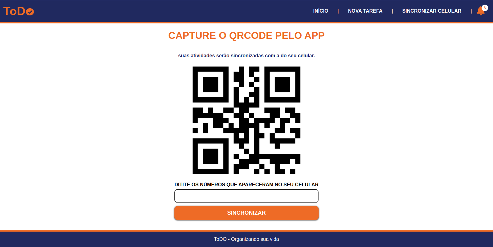
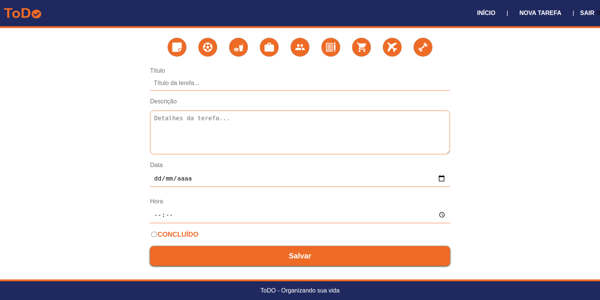

# ToDo_List_CRUD

O ToDo List é um aplicativo que permite o usuário criar, ler, atualizar e apagar uma tarefa, sendo muito util no dia a dia, tornando se uma forma pratica de controle de agenda fazendo com que o usuário evite perder seus compromissos.

<h2><a id="user-content-tech" class="anchor" aria-hidden="true" href="#tech"><svg class="octicon octicon-link" viewBox="0 0 16 16" version="1.1" width="16" height="16" aria-hidden="true"><path fill-rule="evenodd" d="M7.775 3.275a.75.75 0 001.06 1.06l1.25-1.25a2 2 0 112.83 2.83l-2.5 2.5a2 2 0 01-2.83 0 .75.75 0 00-1.06 1.06 3.5 3.5 0 004.95 0l2.5-2.5a3.5 3.5 0 00-4.95-4.95l-1.25 1.25zm-4.69 9.64a2 2 0 010-2.83l2.5-2.5a2 2 0 012.83 0 .75.75 0 001.06-1.06 3.5 3.5 0 00-4.95 0l-2.5 2.5a3.5 3.5 0 004.95 4.95l1.25-1.25a.75.75 0 00-1.06-1.06l-1.25 1.25a2 2 0 01-2.83 0z"></path></svg></a>Tecnologias</h2>

Esse aplicativo foi desenvolvido utilizando:

<ul>
  <li>React JS</li>
  <li>Node JS</li>
  <li>Mongo DB</li>
  <li>Styled Components</li>
</ul>

<h3><a id="user-content-constraints-rules" class="anchor" aria-hidden="true" href="#constraints-rules"><svg class="octicon octicon-link" viewBox="0 0 16 16" version="1.1" width="16" height="16" aria-hidden="true"><path fill-rule="evenodd" d="M7.775 3.275a.75.75 0 001.06 1.06l1.25-1.25a2 2 0 112.83 2.83l-2.5 2.5a2 2 0 01-2.83 0 .75.75 0 00-1.06 1.06 3.5 3.5 0 004.95 0l2.5-2.5a3.5 3.5 0 00-4.95-4.95l-1.25 1.25zm-4.69 9.64a2 2 0 010-2.83l2.5-2.5a2 2 0 012.83 0 .75.75 0 001.06-1.06 3.5 3.5 0 00-4.95 0l-2.5 2.5a3.5 3.5 0 004.95 4.95l1.25-1.25a.75.75 0 00-1.06-1.06l-1.25 1.25a2 2 0 01-2.83 0z"></path></svg></a>Como Utilizar</h3>

<ul>
  <li>
    Nessa versão desktop ao abrir o aplicativo a primeira tela será a de sincronizar celular onde o usuário deverá fazer o sincronismo utilizando o QrCode que         aparecerá;
  </li>
  <li>
    Após o sincronismo o usuário será drecionada a tela Home que mostra todas as tarefas cadastradas até o momento, mas também sendo possivel filtrar as tarefas       pelo dia, semana, mês ou ano, e no canto superior direito mostrará um sino sempre que houver tarefas um atraso;
  </li>
  <li>
    Para cadastrar uma tarefa basta clicar em nova tarefa que está localizado na parte superior do aplicativo, o usuário será direcionado a tela de cadrastro,         sendo todos os campos abrigatórios;
  </li>
  <li>
    Feito o cadastro da tarefa ela parecerá na tela Home;
  </li>
  <li> 
    Quando concluida uma tarefa basta clicar em seu card, o usuário será direcionado a tela de atualizar tarefa, onde será possivel marcar a opição concluida,         desta forma a tarefa continuará aparecendo na tela Home mas estará mais opaca que as outras, tornandoa diferenciada das demais podendo ser identificada qual       está finalizada
  </li>
  <li>
    Também na tela de atualizar pede ser alterada as informaçôes cadastradas até o momento, sendo possivel mudar a hora, dia ou apagar a tarefa caso o usuário         ache necessário;
  </li>
  <li>
    Depois de criar, atualizar ou apagar uma tarefa basta clicar em sair no canto superior direito da tela, com isso a pessoal será redirecionada a tela de sincronizar, tendo novamente que fazer o sincronismo se caso o usuário queira entrar novamente;
  </li>
</ul>

<h2><a id="user-content-preview" class="anchor" aria-hidden="true" href="#preview"><svg class="octicon octicon-link" viewBox="0 0 16 16" version="1.1" width="16" height="16" aria-hidden="true"><path fill-rule="evenodd" d="M7.775 3.275a.75.75 0 001.06 1.06l1.25-1.25a2 2 0 112.83 2.83l-2.5 2.5a2 2 0 01-2.83 0 .75.75 0 00-1.06 1.06 3.5 3.5 0 004.95 0l2.5-2.5a3.5 3.5 0 00-4.95-4.95l-1.25 1.25zm-4.69 9.64a2 2 0 010-2.83l2.5-2.5a2 2 0 012.83 0 .75.75 0 001.06-1.06 3.5 3.5 0 00-4.95 0l-2.5 2.5a3.5 3.5 0 004.95 4.95l1.25-1.25a.75.75 0 00-1.06-1.06l-1.25 1.25a2 2 0 01-2.83 0z"></path></svg></a>Imagens</h2>

Confira algumas imagens do aplicativo:

